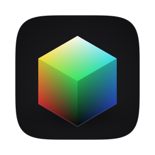
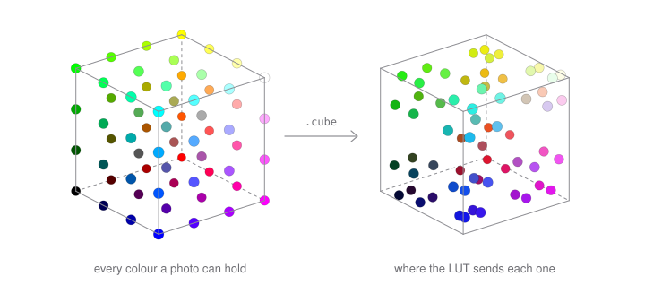
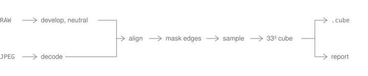

# LUTzy

A macOS app that applies `.cube` LUTs to RAW and other images. It can also build a LUT from a RAW + JPEG pair.

SwiftUI and Core Image, no third-party packages. macOS 26 to run, [Xcode 27 to compile](#build).

A 3D LUT is a table with a color at every lattice point. The photo's colors are looked up in it, interpolated between the nearest points, and replaced. That is the whole trick, and it is why a LUT can be a look but never a sharpen or a blur.



## Features

- **RAW** via `CIRAWFilter`, not the embedded preview.
  DNG, CR2, CR3, NEF, ARW, ORF, RAF, RW2, PEF, SRW, X3F, RAW.
  JPEG, PNG, TIFF, BMP, HEIC.
- **Import** — drop a file, a folder, several files, pictures straight from Photos, or a bitmap from any app. <kbd>⌘O</kbd> file · <kbd>⌘⇧I</kbd> Photos (max 50) · <kbd>⌘⌥I</kbd> source folder.
- **LUTs** — `.cube` 3D (`LUT_3D_SIZE`, `DOMAIN_MIN` / `DOMAIN_MAX`) through `CIColorCubeWithColorSpace` on Metal. Sidebar scans recursively, groups by subfolder, searchable. Intensity 0–100%, in the Adjust inspector. <kbd>⌘⇧L</kbd> picks the folder.
- **Preview** — <kbd>V</kbd> side-by-side / single. Hold <kbd>Space</kbd> in single view for the original. <kbd>↑</kbd> <kbd>↓</kbd> walk the library.
- **Inspector** <kbd>⌘I</kbd>
  - **Info** — histogram of what's on screen (graded, or original while Space is down) plus EXIF / TIFF / GPS
  - **Develop** — the `CIRAWFilter` knobs this file's decoder actually supports
  - **Adjust** — nine sliders after develop, before the LUT: exposure, brightness, contrast, saturation, highlights, shadows, temperature, tint, vibrance
- **Filmstrip** when a source folder is open. <kbd>←</kbd> <kbd>→</kbd> or <kbd>[</kbd> <kbd>]</kbd> step through; the current look stays on. <kbd>⌘R</kbd> rescans.
- **Window** — Liquid Glass toolbar, customizable (View ▸ Customize Toolbar…). The file and LUT names sit in the title. <kbd>⌘,</kbd> sets launch defaults: side-by-side, source browser, export format.
- **Updates** — once a day the packaged app looks at this repo's [releases](https://github.com/tsvb/lutzy/releases) and offers anything newer. LUTzy ▸ Check for Updates… asks now. Install downloads the DMG, verifies the app inside is signed by the same Developer ID team as the running copy, swaps it in place, and relaunches. Off switch and skip-this-version in Settings.
- **Export** — 16-bit TIFF, JPEG (quality 0.95), or PNG, always full resolution, named `{photo}_{LUT}.ext` (spaces in the LUT name become underscores). <kbd>⌘⇧E</kbd> Export All writes the whole look — develop, adjustments, LUT, intensity — and counts failures instead of aborting.

## Derive LUT from JPG

<kbd>⌘D</kbd> — File ▸ Derive LUT from JPG…. Pick the RAW, pick the JPEG, hit Derive.

The JPEG is treated as a look (the manufacturer's color science, or whatever picture profile was on). LUTzy writes the difference against a neutral RAW develop. Same frame required — aspect within 1%. Pixel size can differ.



The result previews on the current image and stays in memory until **Save to LUT Folder…**.

The report is a tone curve (R/G/B vs identity) plus saturation, sharpening, coverage, samples, alignment, and camera EXIF. Sharpening is measured, not applied — a cube can't sharpen, and there isn't a second stage that does.

<details>
<summary>How the cube is built</summary>

The RAW is developed with the same default `CIRAWFilter` settings the rest of the app uses, so the LUT applies without a baseline mismatch. Both images are Lanczos-scaled onto a shared working extent (long edge capped at 3000 px — 200k samples don't get better from a 60 MP buffer) and aligned by luma cross-correlation. An edge mask on the JPEG keeps in-camera sharpening out of the color samples. Surviving pixels (~200k, from a 2M draw) fill a 33³ cube; empty cells are pulled from neighbors, then identity.

</details>

## Shortcuts

**Preview**

| Key | Action |
|:---|:---|
| <kbd>↑</kbd> <kbd>↓</kbd> | previous / next LUT |
| <kbd>←</kbd> <kbd>→</kbd> or <kbd>[</kbd> <kbd>]</kbd> | previous / next image |
| <kbd>Space</kbd> (hold) | original, in single view |
| <kbd>V</kbd> | side-by-side / single |
| <kbd>⌘I</kbd> | inspector |

**File**

| Key | Action |
|:---|:---|
| <kbd>⌘O</kbd> | open image |
| <kbd>⌘⇧I</kbd> | Photos |
| <kbd>⌘⌥I</kbd> | source folder |
| <kbd>⌘R</kbd> | rescan source folder |
| <kbd>⌘⇧L</kbd> | LUT folder |
| <kbd>⌘D</kbd> | derive |
| <kbd>⌘S</kbd> | export |
| <kbd>⌘⇧E</kbd> | export all |
| <kbd>⌘,</kbd> | settings — launch defaults, update checks, and the sidebar's collapsed folders |

Letter keys go through SwiftUI's `.onKeyPress` on the split view; the preview canvas is focusable and holds focus by default so the handler always has a focused descendant. <kbd>⌘</kbd> shortcuts go through the menu bar.

## Build

```bash
swift run           # launch
open Package.swift  # same binary, Xcode debugger
swift test
```

> [!IMPORTANT]
> `swift run` and Run from Xcode both produce a SwiftPM executable, not a sandboxed `.app`. LUT folder and source folder do not persist across launches.

There is no `.xcodeproj`. `Package.swift` excludes `Assets.xcassets` and `LUTzy.entitlements`, and a SwiftPM executable has no `Info.plist` or bundle identifier, so `swift run` uses neither the icon in the appiconset nor the entitlements file. The release script below applies the icon and an `Info.plist`. The entitlements (sandbox, user-selected files, app-scoped bookmarks) are real and still unused; wiring them up needs an Xcode app target this repo doesn't have.

- **Run** — macOS 26
- **Compile** — Xcode 27 / macOS 27 SDK

Deployment target and SDK are different things. The compiler rejects API newer than 26 unless it's `#available(macOS 27, *)`-guarded, and a macOS 27 symbol has to be in the SDK before it can be referenced at all — `#available` does not conjure a missing symbol — so Xcode 26 can't build the package. The binary still runs on 26.

`swift test` generates fixtures into a temp directory. Tests that need a real RAW/JPEG pair look in `realworldtest/` (gitignored) and skip if it isn't there. `LUTZY_BENCH=1` for the preview-cost tests. CI is debug build → test → release build on GitHub's `xcode-27` runner.

<details>
<summary>Layout and render path</summary>

Everything of substance is in `Sources/LUTzyKit`. `Sources/LUTzy` is `@main` plus an AppDelegate that forces `.regular` activation, because a bare executable otherwise starts as a background process with no Dock icon. Only `ContentView` and `LUTzyCommands` are public, so the kit can be `@testable import`ed.

The look is an `EditDocument` (develop + adjustments + LUT). Preview, histogram, and both export paths render that document through one `RenderEngine` actor / one `CIContext`. Preview vs export differs only by scale: 1600×1200 vs full. `WorkingSpace` (sRGB) is used for both cube interpolation and encoding. Non-RAW files go through `ImageDecoder.orientedLoadOptions` because `CIImage(contentsOf:)` ignores EXIF orientation and `CIRAWFilter` doesn't.

Swift 6 language mode on every target. No `@unchecked Sendable`, `nonisolated(unsafe)`, or `@preconcurrency`.

</details>

Pipeline notes: [docs/PHASE2_SPEC.md](docs/PHASE2_SPEC.md). Standing review: [docs/CODE_REVIEW.md](docs/CODE_REVIEW.md).

## Release

```bash
DEVELOPER_ID_APP="Developer ID Application: Your Name (TEAMID)" \
NOTARY_PROFILE="your-notarytool-profile" \
scripts/release-dmg.sh 0.1.1
```

Does what an Xcode archive would: universal release build, a hand-written `LUTzy.app` with an `Info.plist` and the icon, signed with Developer ID and the hardened runtime (no sandbox yet), notarized and stapled, then packed into a DMG that is notarized and stapled again. Output lands in `build/release/`. Needs `create-dmg` (`brew install create-dmg`) and a notarytool keychain profile.

Publish the DMG as a GitHub release tagged `vX.Y.Z`, the same triple passed to the script. The in-app updater reads `releases/latest` and picks the first `.dmg` asset, so a release without one is offered as a page to open rather than an install.

The icon is drawn by `scripts/render-icon.swift`: the RGB cube a `.cube` file indexes, seen from its green corner, rendered into every slot of the appiconset. Run it again rather than editing the PNGs.

## License

[MIT](LICENSE)
